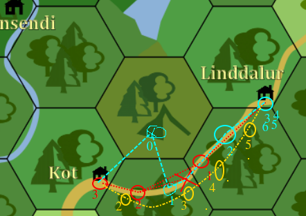

# Leitin að Eggert
Bússurnar fá þær leiðbeiningar að finna manninn sem réðst í skóginn og drap 
álfa.

### Upprifjun eftir síðasta sessjón
- [Jelena](/npcs/jelena.md) í Lindum bað bússurnar um að fara með bréf til 
  systur sinnar Amöndu sem býr í Koti.
  - Jelena gaf þeim kort af landinu í þakkabót.
- Mættuð Eggerti og föruneyti hans (3 aðrir) á förnum vegi.
- Þegar mætt var í Kot þá var þeim fljótt ljóst að
  - Allir í bænum voru dauðir upp í rúmi.
  - Ekkert barn var að finna meðal hinna dauðu.
  - Sum rúm voru tóm.
  - Gullpyngja var að finna í húsunum í þeim húsum sem voru ekki með tómum 
    rúmum.
    - Peningarnir voru 5 x fjöldi líka.
  - Líkin voru öll með ótrúlega lítið af blóði.
  - Líkin sýndu enga áverka nema pínulítið sár á öxinni sem var byrjað að gróa.
- Bússurnar gistu ekki í Koti, en gistu rétt fyrir utan og mættu [Suzengu](
  /npcs/suzenga.md)
  - Hún lýsti því að fyrir tveim dögum réðst hópur manna á þau í skóginum.
    - Álfarnir voru að vinna þegar mennirnir gripu til einhverra flaskna með
      rauðum vökva sem læknaði öll sár. 
    - Hún biður bússurnar um hjálp þeirra til að skila þeim til sín lífs eða 
      liðnum og þá koma í veg fyrir að 
  
### Bússurnar frá Lindum
- 0: Leggja af stað frá lindum
- 1: Mæta Eggert stuttu fyrir svefn
- 2: Ráðist á þá um nóttina, mæta í kot og hitta álfana

### Tímalína Eggerts
- -3:-2: Búa til blóðmerkin í Koti
- -1: Leggja af stað til Nornatannar
- 0: Finna leið á stiginn frá Rótum Nornatannar
- 1: Mæta Bósunum
- 2: Önnur nótt á stígnum, mæta í kot
- 3-4: Búa til Blóðmerki
- 5: Leggja af stað til Nornatannar

### Krakkarnir
- 2: Fyrsta nótt á stígnum

